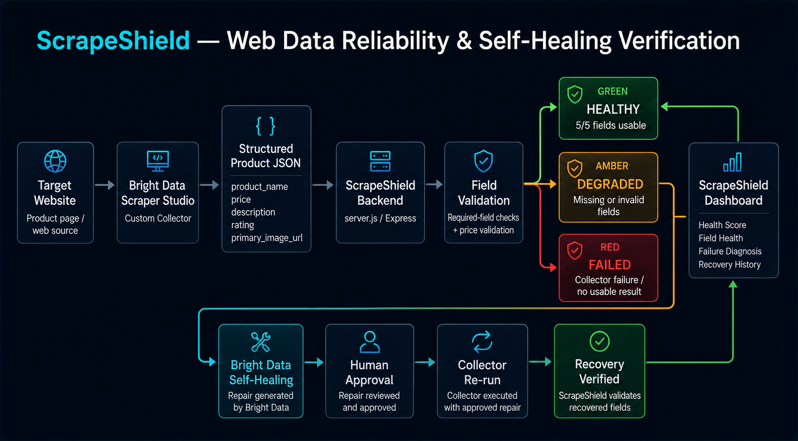

# ScrapeShield

> Self-healing web intelligence — a reliability layer for a Bright Data Scraper Studio collector.

ScrapeShield is a lightweight web-data reliability dashboard built around a custom Bright Data Scraper Studio collector. It runs the collector, validates the structured data that comes back, scores extraction health, and makes scraper failures and recoveries visible — so you can trust the data your pipeline depends on.

## Problem

Websites change constantly. A scraper that works today can silently start returning incomplete or malformed data tomorrow when the target page structure changes — a missing price, an empty title, a broken image URL. These failures are easy to miss and expensive to debug, because the scraper still "runs" and still returns *something*.

## Solution

ScrapeShield adds a reliability layer around an existing Bright Data collector. It:

1. Runs the existing Bright Data Scraper Studio collector.
2. Receives the structured product JSON.
3. Validates every required field.
4. Calculates an extraction health score (`HEALTHY` / `DEGRADED` / `FAILED`).
5. Identifies exactly which fields are missing or invalid.
6. Records **real** recovery events when a previously unhealthy collector returns to full health.
7. Verifies the result after a Bright Data Self-Healing repair.

> ScrapeShield **monitors and verifies**. Bright Data Scraper Studio performs the actual scraper self-healing.

## Architecture

ScrapeShield monitors and verifies the output of a Bright Data Scraper Studio collector.


```

The stack is deliberately small: an Express server (`server.js`), a static single-page dashboard (`public/`), and two JSON data files (`data/`). There is no build step and no frontend framework.

## Bright Data Scraper Studio usage

ScrapeShield does not scrape pages itself. It shells out to an existing, already-configured Bright Data collector through the Bright Data CLI (`bdata`):

```bash
bdata scraper run <collector_id> <product_url> --pretty
```

- The collector ID is configured in `server.js` (`CONFIG.collectorId`) and can be overridden with the `BRIGHT_DATA_COLLECTOR_ID` environment variable.
- Credentials never touch this project — they live in the Bright Data CLI's own local login store. ScrapeShield never logs or returns raw CLI output, so account details can't leak into API responses.
- The collector ID is format-validated before use, and CLI output is parsed defensively (tolerant of surrounding progress text, without `eval`).

> **Prerequisite for live mode:** the Bright Data CLI must be installed and logged in on the machine running the server. If it isn't, live mode reports a `FAILED` state (by design) and you can still explore every other state using Demo Mode (below).

## Self-healing workflow

ScrapeShield observes and verifies the self-healing loop; Bright Data performs the repair:

1. **Scrape completed** — the collector returns a payload.
2. **Failure detected** — ScrapeShield validation flags missing/invalid fields (`DEGRADED`) or a failed run (`FAILED`).
3. **Bright Data Self-Healing** — Bright Data repairs the collector. *External step — not performed or claimed by this dashboard.*
4. **Repair approved** — *external approval step.*
5. **Recovery verified** — when a later live run comes back fully valid after an unhealthy one, ScrapeShield records a **real** recovery event noting exactly which fields were restored.

Recovery events are only ever recorded from real live runs. A recovery that follows a `DEGRADED` state lists the exact fields that were missing; a recovery that follows a hard `FAILED` run makes no per-field claim, because a failed run carries no field-level detail. **Demo Mode never creates or alters recovery history.**

## Required fields

A run is `HEALTHY` only when all five required fields carry usable values:

| Field | Notes |
| --- | --- |
| `product_name` | Non-empty string |
| `price` | Object `{ value, currency, symbol }` — only valid when `value` is present. A `{ "value": null }` price is treated as **invalid** |
| `description` | Non-empty string |
| `rating` | Non-empty value |
| `primary_image_url` | Non-empty string |

If one or more fields are unusable, the run is `DEGRADED` and those fields are listed. If the collector run itself cannot complete, the run is `FAILED`.

## Example structured output

A healthy collector response looks like this:

```json
{
  "product_name": "Aurora Wireless Headphones",
  "price": { "value": 142.75, "currency": "USD", "symbol": "$" },
  "description": "Over-ear wireless headphones with 40 mm drivers, 32 hours of battery, and memory-foam cups.",
  "rating": 4.6,
  "primary_image_url": "https://example.com/images/aurora.jpg"
}
```

The dashboard API (`/api/dashboard`) wraps that in reliability metadata:

```json
{
  "status": "healthy",
  "product": { "product_name": "Aurora Wireless Headphones", "price": { "value": 142.75, "currency": "USD", "symbol": "$" }, "description": "…", "rating": 4.6, "primary_image_url": "https://…" },
  "missingFields": [],
  "recoveryEvent": null,
  "history": [],
  "collectorId": "c_xxxxxxxxxxxx",
  "checkedAt": "2026-08-23T12:00:00.000Z"
}
```

## Demo modes

Demo Mode lets anyone explore every dashboard state without a live Bright Data run — ideal for reviewers who don't have the CLI configured. Use the **Data Source** control at the top of the dashboard (`Live` / `Healthy` / `Degraded` / `Failed`), or drive it directly via the query string:

| Mode | URL | What it shows |
| --- | --- | --- |
| Live | `/` | Real collector run (requires the Bright Data CLI) |
| Healthy | `/?demo=healthy` | Fully valid fixture data |
| Degraded | `/?demo=degraded` | Fixture data with the price removed (one missing field) |
| Failed | `/?demo=failed` | A simulated collector failure |

**Demo Mode is read-only.** It is computed entirely from local fixture data (`data/demo-product.json`), never runs the collector, never fabricates recovery events, and never modifies `data/healing-history.json`. A banner makes it obvious when Demo Mode is active.

## Installation

Requirements: Node.js 18+.

```bash
git clone <your-repo-url>
cd scrapeshield
npm install
```

For **live mode only**, also install and log in to the Bright Data CLI so that `bdata` is on your `PATH`. Demo modes need nothing beyond Node.

## Running locally

```bash
npm start
```

Then open <http://localhost:3000>.

Optional environment variables:

```bash
PORT=4000 BRIGHT_DATA_COLLECTOR_ID=c_yourcollector npm start
```

To open straight into a demo view (no CLI required):

```text
http://localhost:3000/?demo=degraded
```

## Testing

Syntax-check the server:

```bash
node --check server.js
```

Run the unit tests. They require no network or external services — they exercise field validation, the price-value check, and recovery reporting against the real functions exported from `server.js`:

```bash
npm test
```

Manual smoke test of the API:

```bash
npm start
# in another terminal:
curl "http://localhost:3000/api/dashboard?demo=healthy"
curl "http://localhost:3000/api/dashboard?demo=degraded"
curl "http://localhost:3000/api/dashboard?demo=failed"
```

`data/healing-history.json` should be byte-for-byte unchanged after any number of demo requests — that isolation is part of what the tests and manual checks confirm.

## AI-assisted development disclosure

This project was developed with AI assistance. An AI coding assistant (Anthropic's Claude) was used for code review, debugging, documentation, and implementation support. All AI-suggested changes were directed, reviewed, and verified by the human author(s). The Bright Data collector itself was created and configured by the team, not generated by AI, and no product data or recovery events were fabricated by the assistant — demo data is clearly labeled fixture data and is isolated from real recovery history.

## Team contributions

<!-- Replace the placeholders below with your real names and a short summary of what each person did. -->

| Member | Contributions |
| --- | --- |
| _Ayush Vij_ | Bright Data collector setup, backend (`server.js`), field validation & recovery logic |
| _Namandeep Singh Taunk_ | Dashboard UI (HTML/CSS/JS), demo modes, documentation |

## License

Released under the MIT License. See [LICENSE](LICENSE).
